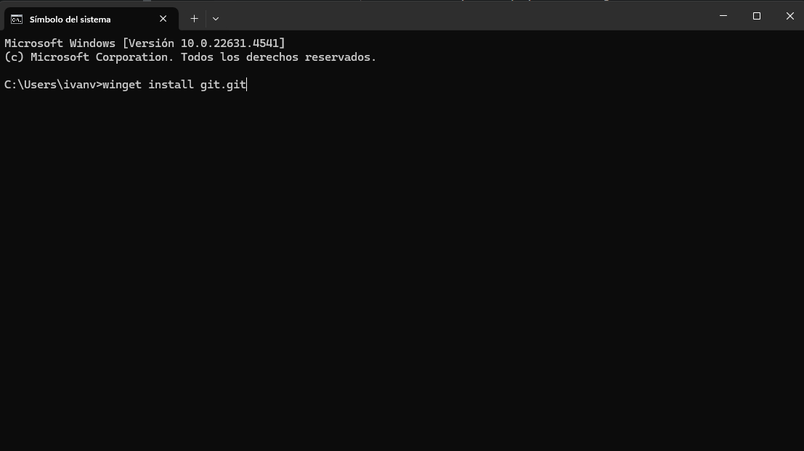
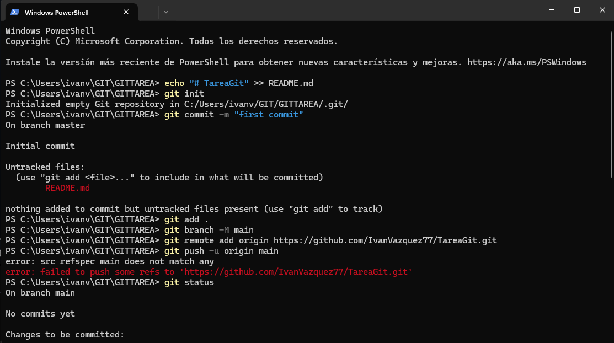
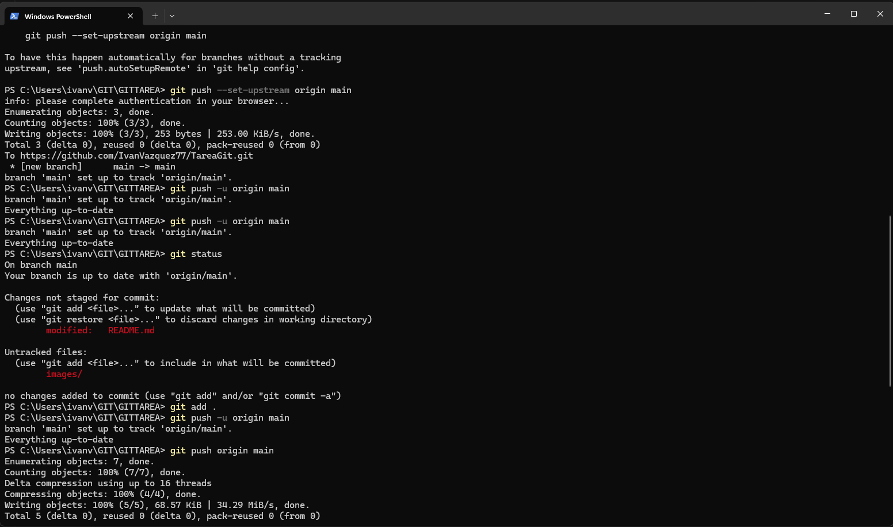

# TareaGit
Mi nombre es Ivan Vazquez Louzao En esta tarea he creado este fichero markdown en el cual voy a realizar la documentacion del ejercicio.

# Imagenes
En la carpeta images he subido las capturas que documentan los pasos que he realizado

# Instalar GIT
A traves del comando winget install git.git he instalado GIT

# Crear repositorio remoto
## Mediante estos comandos he configurado el repositorio remoto
## echo "# TareaGit" >> README.md
## git init
## git add README.md
## git commit -m "first commit"
## git branch -M main
## git remote add origin https://github.com/IvanVazquez77/TareaGit.git
## git push -u origin main

#  Subir archivos al repositorio remoto
Mediante el comando Git push he subido los archivos al repositorio

